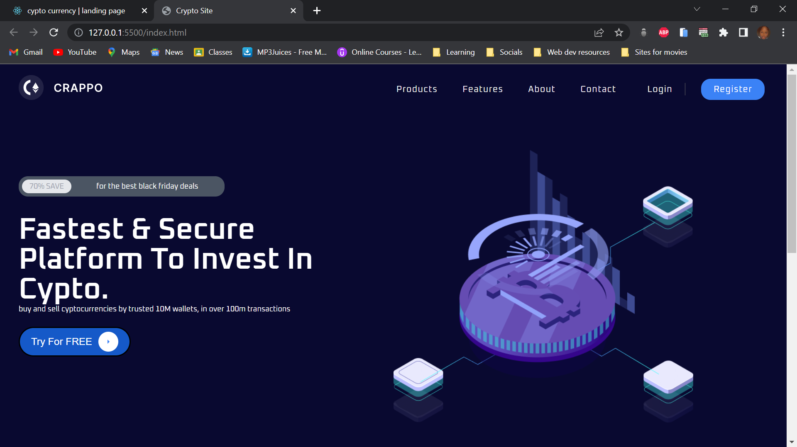
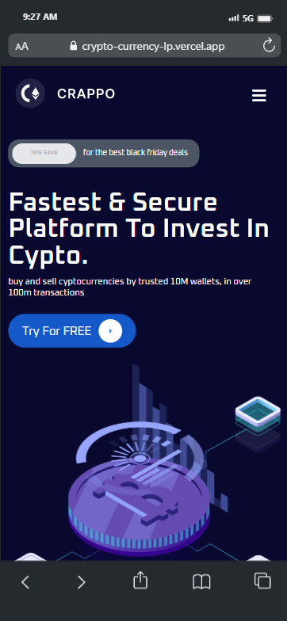

# crypto-currency-lp

This is a solution to the [September coding 360 challenge](https://crypto-currency-lp.vercel.app/).
## Table of contents

- [Overview](#overview)
  - [The challenge](#the-challenge)
  - [Screenshot](#screenshot)
  - [Links](#links)
- [My process](#my-process)
  - [Built with](#built-with)
  - [What I learned](#what-i-learned)
- [Author](#author)

## Overview

### The challenge

Users should be able to:

- View the optimal layout for the site depending on their device's screen size
- See hover states for all interactive elements on the page

### Screenshot

### Links

- Solution URL: [Add solution URL here](https://github.com/iampearlep/crypto-currency-lp)
- Live Site URL: [Add live site URL here](https://crypto-currency-lp.vercel.app/)

## My process

### Built with

- Semantic HTML5 markup
- CSS custom properties
- Flexbox
- CSS Grid
- Aos/Animate on scroll - Animation Library

### What I learned

I learnt how to use the Animate on scroll library.

## Author

- Twitter - [@alwayspearlxx](https://www.twitter.com/alwayspearlxx)
